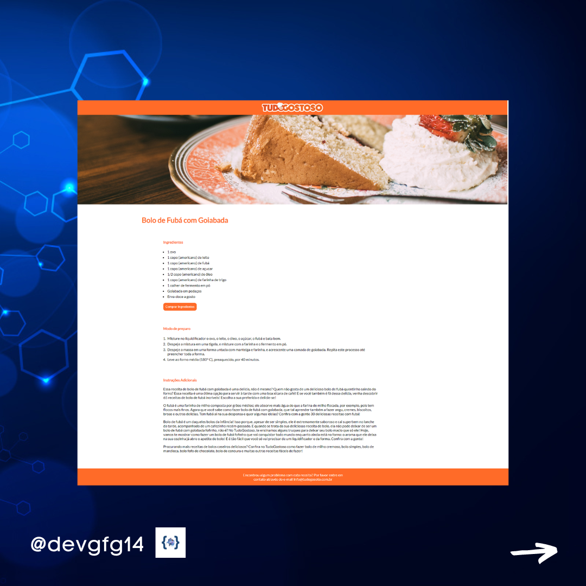

<h1 align="center"> Página de Receitas </h1>

  <a href="#-tecnologias">Tecnologias</a>&nbsp;&nbsp;&nbsp;|&nbsp;&nbsp;&nbsp;
  <a href="#-projeto">Projeto</a>&nbsp;&nbsp;&nbsp;|&nbsp;&nbsp;&nbsp;
  <a href="#-layout">Redes sociais</a>

 

  

## 🚀 Tecnologias

Esse projeto foi desenvolvido com as seguintes tecnologias:

- HTML 

- CSS 

## 📝 Projeto

Essa é uma página de receitas simples e resposiva Feita no curso fullstack do ProgramadorBr.

- [Acesse o projeto finalizado, online](https://guilhermegfg.github.io/PaginaReceitas-ProgBr/)

## 💻 Redes sociais

 &nbsp;&nbsp;&nbsp;  &nbsp;&nbsp;&nbsp; &nbsp;&nbsp;&nbsp;  &nbsp;&nbsp;&nbsp; 

Feito com ♥ by Guilherme Fernandes Gonçalves

<a target="_blank" href="https://icons8.com/icon/Xy10Jcu1L2Su/instagram">Instagram</a> icon by <a target="_blank" href="https://icons8.com">Icons8</a>